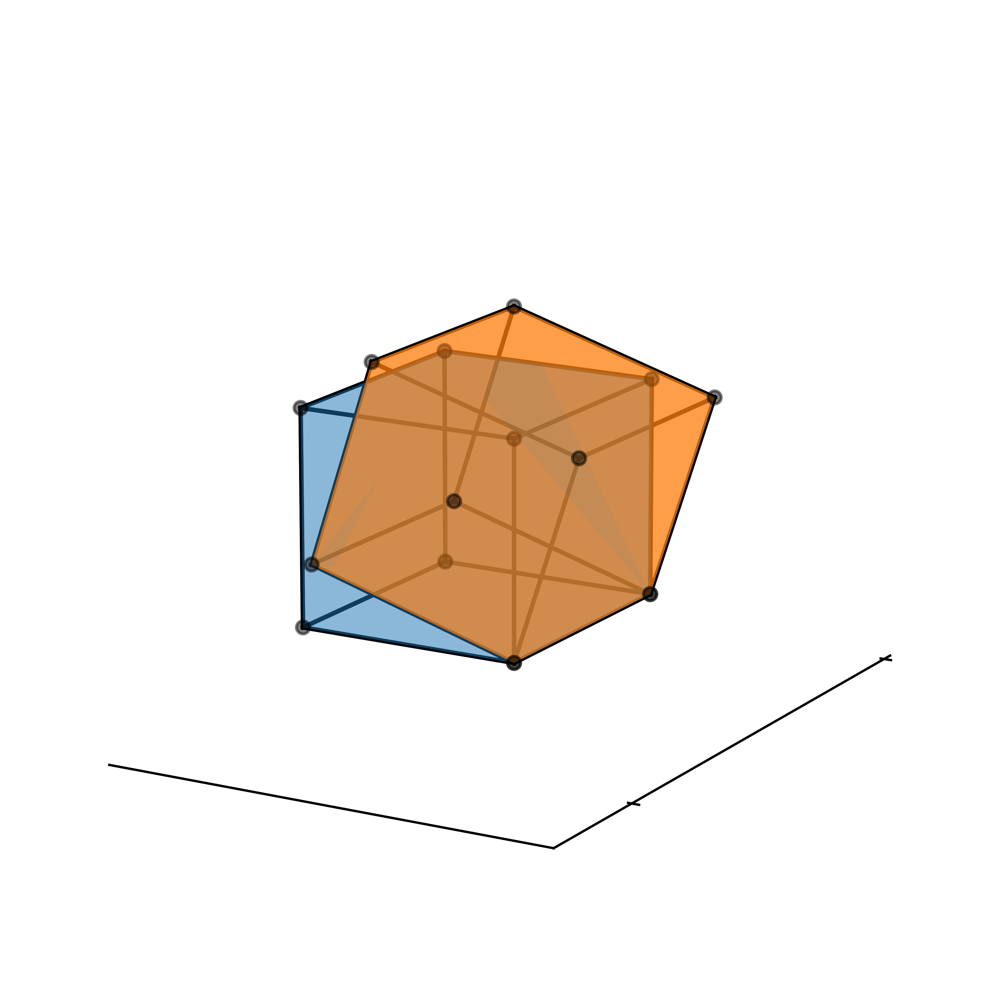

<p align="center">

</p>


# OGraph

A lightweight Matplotlib wrapper.

## Installation

Install from PyPI:

```shell
pip install ograph
```

Install from source:

```
pip install .
```

Please see [documentation](https://yidingli.com/projects/ograph/docs/install-and-build.html) for detailed instructions.

## Components

The library have the following modules:

| Component                                          | Description                |
| -------------------------------------------------- | -------------------------- |
| [ofig](./ograph/ofig/)                             | Create 2-D and 3-D figures |
| [oplot](./ograph/oplot/)                           | Plot 2-D and 3-D diagrams  |
| [ofunc](./ograph/ofunc/)                           | Test functions             |
| [oconfig](./ograph/oconfig/)                       | Configure decorations      |
| [applications.swarm](./ograph/applications/swarm/) | Plot point clusters        |

